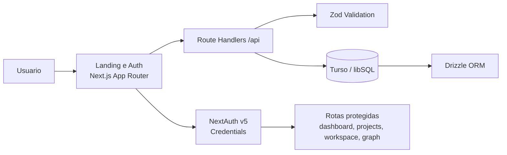

# Nexus

<p align="center">
	<strong>Where your agents think together.</strong><br />
	Plataforma local-first para orquestração de agentes de código com contexto compartilhado.
</p>

<p align="center">
	<a href="https://nextjs.org"></a>
	<a href="https://www.typescriptlang.org/"></a>
	<a href="https://pnpm.io/"></a>
	<a href="https://zod.dev/"></a>
</p>

---

## Índice

- [Visão geral](#visão-geral)
- [Status atual (Fase 0)](#status-atual-fase-0)
- [Arquitetura do produto](#arquitetura-do-produto)
- [Stack técnica](#stack-técnica)
- [Estrutura de pastas](#estrutura-de-pastas)
- [Começando em 5 minutos](#começando-em-5-minutos)
- [Variáveis de ambiente](#variáveis-de-ambiente)
- [Scripts do projeto](#scripts-do-projeto)
- [Padrões e guardrails de engenharia](#padrões-e-guardrails-de-engenharia)
- [Fluxo de desenvolvimento recomendado](#fluxo-de-desenvolvimento-recomendado)
- [Roadmap](#roadmap)
- [Troubleshooting rápido](#troubleshooting-rápido)

---

## Visão geral

O **Nexus** é uma plataforma para centralizar sessões de agentes de código em um único lugar, preservando decisões e contexto para acelerar entregas técnicas.

Princípios do projeto:

- **Local-first:** roda na máquina do usuário.
- **Contexto compartilhado:** decisões e artefatos podem evoluir em grafo.
- **Qualidade por contrato:** validação com Zod, TypeScript strict e padrões fortes de arquitetura.

---

## Status atual (Fase 0)

Entregue hoje:

- Landing page completa com seções de marketing.
- Fluxo de autenticação com **NextAuth v5 (Credentials)**.
- Registro de usuário com validação e hash de senha.
- Dashboard autenticado (base para as próximas fases).
- Tema dark/light com `next-themes` e variáveis CSS.

Em progresso para próximas fases:

- Sessões PTY via WebSocket.
- Grafo de contexto com extração automática.
- Injeção de contexto entre agentes.
- Multi-agente colaborativo.

---

## Arquitetura do produto



Arquitetura por camadas:

1. **UI Layer (App Router):** páginas públicas, auth e área autenticada.
2. **API Layer:** handlers com validação de entrada usando Zod.
3. **Domain/Data Layer:** Drizzle ORM sobre Turso/libSQL.
4. **Auth Layer:** sessão JWT com callbacks de role/identidade.

---

## Stack técnica

| Categoria   | Tecnologia              | Observação                             |
| ----------- | ----------------------- | -------------------------------------- |
| Framework   | Next.js 16 (App Router) | Estrutura principal da aplicação       |
| Linguagem   | TypeScript strict       | `strict` + `noUncheckedIndexedAccess`  |
| Estilização | Tailwind CSS v4         | Tokens por CSS variables               |
| UI          | shadcn/ui + Radix       | Componentes acessíveis                 |
| Animação    | Motion (Framer Motion)  | Landing e experiências de transição    |
| Auth        | next-auth v5 beta       | Credentials provider                   |
| Banco       | Turso / libSQL          | Ambiente local-first com arquivo local |
| ORM         | Drizzle ORM             | Schema tipado e migrations             |
| Forms       | React Hook Form + Zod   | Validação robusta de entrada           |
| Tooling     | Biome + TypeScript      | Lint, formatação e typecheck           |

---

## Estrutura de pastas

```text
nexus/
├── src/
│   ├── app/
│   │   ├── (marketing)/
│   │   ├── (auth)/
│   │   ├── (app)/
│   │   └── api/
│   ├── components/
│   │   ├── theme/
│   │   └── ui/
│   ├── lib/
│   │   ├── auth.ts
│   │   ├── env.ts
│   │   └── db/
│   ├── types/
│   └── proxy.ts
├── docs/
├── public/
├── AGENTS.md
└── package.json
```

> Nota: o script `pnpm server` já está configurado, porém o diretório `server/` ainda não foi versionado nesta fase.

---

## Começando em 5 minutos

### 1) Pré-requisitos

- Node.js 20+
- pnpm 9+

### 2) Instalar dependências

```bash
pnpm install
```

### 3) Configurar ambiente

Crie um arquivo `.env.local` na raiz com base na seção [Variáveis de ambiente](#variáveis-de-ambiente).

### 4) Subir aplicação

```bash
pnpm dev
```

Abra `http://localhost:3000` no navegador.

---

## Variáveis de ambiente

As variáveis são validadas em `src/lib/env.ts` com Zod.

```env
NEXTAUTH_SECRET=
NEXTAUTH_URL=http://localhost:3000
ANTHROPIC_API_KEY=sk-ant-... # opcional na fase atual
DATABASE_URL=file:./nexus.db
# DATABASE_AUTH_TOKEN=
WS_SERVER_PORT=3001
NODE_ENV=development
```

Regras:

- Não comitar segredos.
- Preferir `.env.local` para execução local.
- Evitar acesso direto a `process.env` fora de `src/lib/env.ts`.

---

## Scripts do projeto

| Script                | Comando            | Uso                                   |
| --------------------- | ------------------ | ------------------------------------- |
| Dev web               | `pnpm dev`         | Sobe o app Next.js                    |
| Build                 | `pnpm build`       | Build de produção                     |
| Start                 | `pnpm start`       | Executa build em modo produção        |
| Typecheck             | `pnpm typecheck`   | Validação TypeScript                  |
| Lint                  | `pnpm lint`        | Checagem com Biome                    |
| Format                | `pnpm format`      | Formata código                        |
| DB generate           | `pnpm db:generate` | Gera migration Drizzle                |
| DB migrate            | `pnpm db:migrate`  | Aplica migrations                     |
| DB studio             | `pnpm db:studio`   | Interface do banco                    |
| DB seed               | `pnpm db:seed`     | Semeia usuário inicial                |
| WS server (planejado) | `pnpm server`      | Script já definido para fase seguinte |
| Dev all (planejado)   | `pnpm dev:all`     | App + server em paralelo              |

---

## Padrões e guardrails de engenharia

Este projeto adota disciplina forte para manter consistência e qualidade:

- **pnpm apenas** como package manager.
- **TypeScript strict** sem atalhos inseguros.
- **Zod em todo input externo** (API/forms/env).
- **Server Components por padrão**; `use client` só quando necessário.
- **Sem logs de debug em produção**.
- **Migrations via Drizzle** (não editar SQL gerado manualmente).

Checklist mínimo antes de concluir uma tarefa:

```bash
pnpm typecheck
pnpm lint
pnpm build
```

---

## Fluxo de desenvolvimento recomendado

1. Atualize schema/tipos/componentes.
2. Rode `pnpm typecheck` para validar contratos.
3. Rode `pnpm lint` e `pnpm format` para consistência.
4. Se mudou banco, gere e aplique migrations.
5. Valide visualmente dark/light e fluxo de auth.

---

## Roadmap

| Fase   | Foco                      |
| ------ | ------------------------- |
| Fase 0 | Landing + Auth            |
| Fase 1 | Sessões PTY via WebSocket |
| Fase 2 | Multi-terminal + Projetos |
| Fase 3 | Grafo de contexto         |
| Fase 4 | Injeção de contexto       |
| Fase 5 | Multi-usuário             |

---

## Troubleshooting rápido

### Erro de hidratação em tema

- Garanta `suppressHydrationWarning` no `<html>` do layout raiz.
- Verifique se `ThemeProvider` está envolvendo a aplicação.

### Erro de login/registro

- Confirme `NEXTAUTH_SECRET` e `NEXTAUTH_URL`.
- Verifique `DATABASE_URL` válido e banco acessível.

### Erro em scripts de servidor WS

- Nesta fase, `server/index.ts` ainda não está presente no repositório.
- Use `pnpm dev` para desenvolvimento da Fase 0.

---

## Licença

Defina aqui a licença oficial do projeto (ex.: MIT) quando o repositório entrar em fase de distribuição pública.
